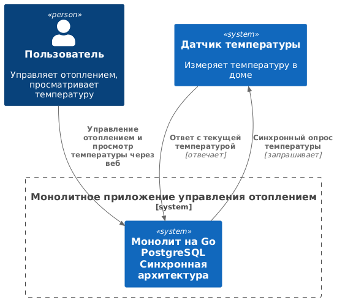
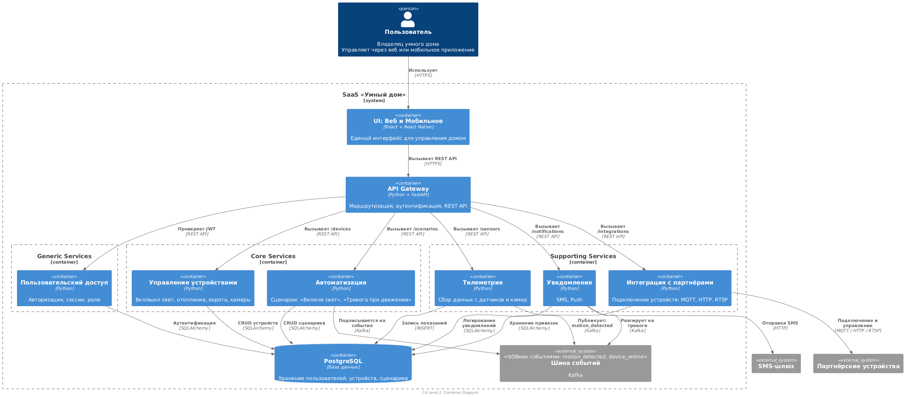
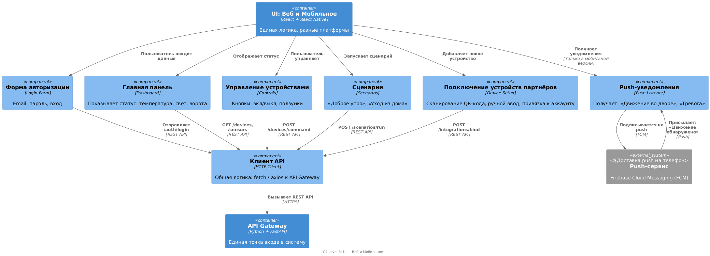
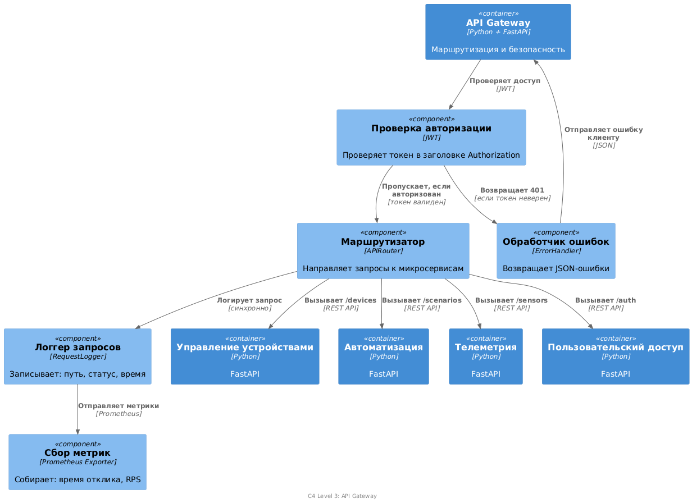
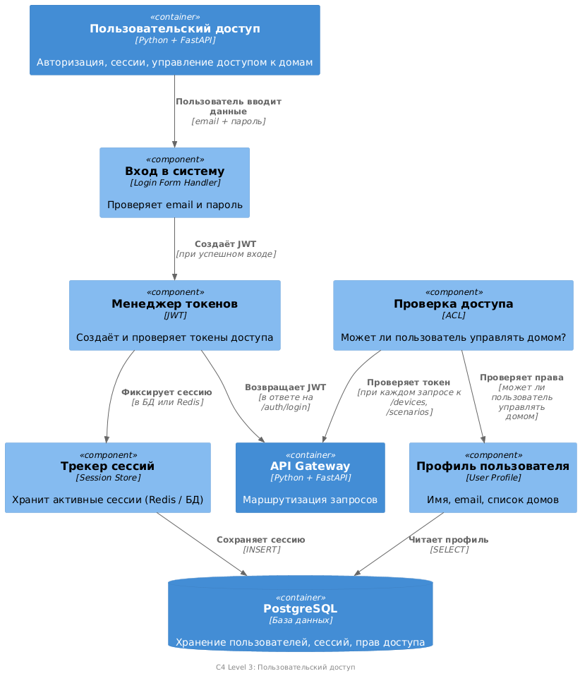
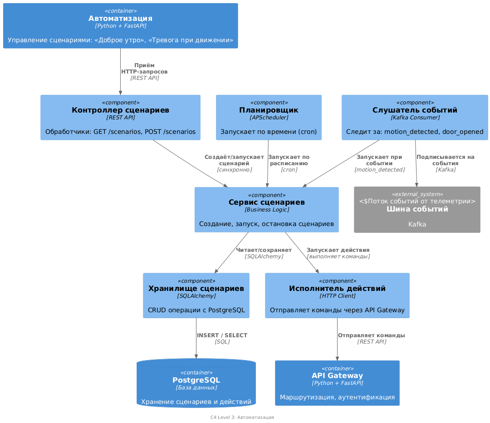
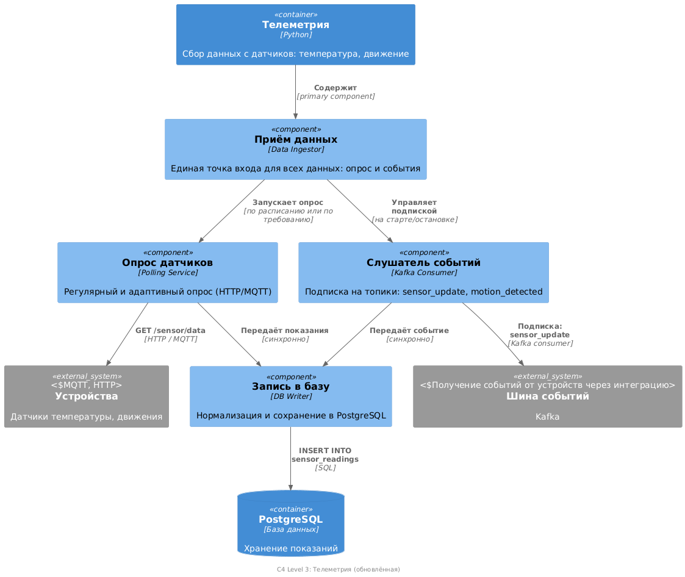
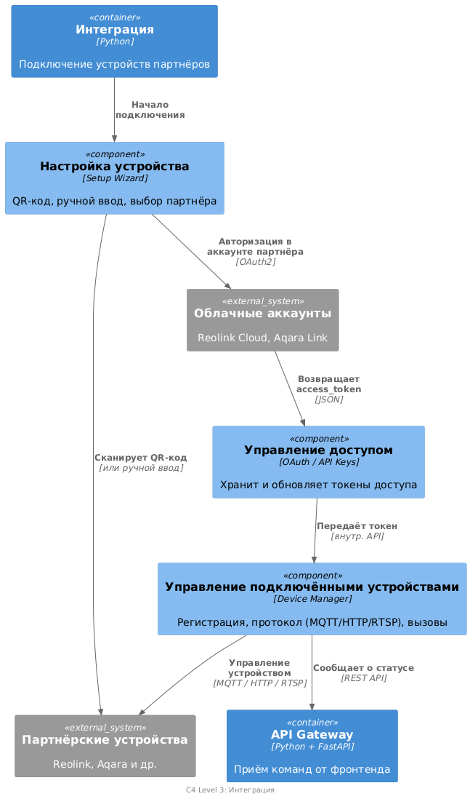
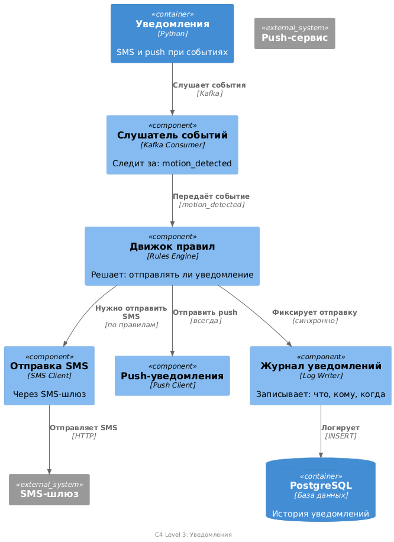

# Project_template


# Задание 1. Анализ и планирование

### 1. Описание функциональности монолитного приложения

**Управление отоплением:**

- Пользователи могут удалённо включать/выключать отопление в своих домах
- Система управляет сигналами реле для включения/выключения отопления в домах

**Мониторинг температуры:**

- Пользователи могут просматривать текущую температуру в своих домах через веб-интерфейс
- Система получает данные о температуре с датчиков, установленных в домах
- Система регистрирует датчики при их включении


### 2. Анализ архитектуры монолитного приложения

Язык программирования: Go
База данных: PostgreSQL
Архитектура: Монолитная, все компоненты системы (обработка запросов, бизнес-логика, работа с данными) находятся в рамках одного приложения.
Взаимодействие: Синхронное, запросы обрабатываются последовательно.
Масштабируемость: Ограничена, так как монолит сложно масштабировать по частям.
Развертывание: Требует остановки всего приложения.

### 3. Определение доменов и границы контекстов

🧩 1.Управление устройствами (Core Domain)
#### Entities (Сущности)
Модуль - имеет уникальный module_id, привязку к дому, признак вкл/выкл \
Устройство - имеет уникальный device_id, статус, имя и привязку к дому.\
Команда- инструкция, отправленная устройству: «включить», «открыть» и тд

#### Value Objects (Объекты-значения)
Статус устройства: "on", "off", "error", "offline" \
Действие (Тип команды: "turn_on", "set_temperature", "open_gate")\
Параметры устройства: яркость (0–100%), температура (22.5°C) , хранится как JSON-объект\

#### Aggregate (Агрегат)
Устройство - управляет жизненным циклом устройства и его команд (Command)\
Все изменения устройства (включая отправку команд) проходят через него.

#### Repositories (Репозитории)
DeviceRepository - Интерфейс для сохранения, поиска и загрузки агрегатов Device.
CommandRepository - Хранит и извлекает команды, связанные с устройствами.
Используется для аудита и отладки.

#### Services (Сервисы)
DeviceControlService
Выполняет доменные операции: отправка команды, синхронизация статуса, проверка доступности.


🧩 2. Автоматизация (Subdomain)

#### Entities (Сущности)
Сценарий: Набор действий, выполняемых по условию или расписанию\
Действие (Действие в сценарии)

#### Value Objects (Объекты-значения)
Условие запуска: "motion_detected", "time_09:00", "temperature > 25"\
Тип действия : какое действие выполнить "turn_on", "send_notification" \
Задержка
#### Aggregate (Агрегат)
Сценарий   Управляет коллекцией Действие.

#### Repositories (Репозитории)
ScenarioRepository: Работает с агрегатами Сценарий: сохранение, поиск по дому, активация\
ActionRepository: Получает действия по scenario_id
#### Services (Сервисы)
AutomationService - запускает сценарии, проверяет условия, планирует выполнение по расписанию.

🧩 3. Телеметрия (Subdomain)
#### Entities (Сущности)
Показание датчика
Событие с датчика
#### Value Objects (Объекты-значения)
Значение измерения: Числовое значение + единица измерения: 23.5, "°C")\
Данные события: дополнительная информация
#### Aggregate (Агрегат)
SensorReading / SensorEvent

#### Repositories (Репозитории)
ReadingRepository Сохраняет и извлекает показания по устройству и времени \
EventRepository Публикует события в шину (Kafka)\
#### Services (Сервисы)
TelemetryService Собирает данные, обнаруживает события (например, движение), публикует их\

🧩 4. Интеграция с партнёрами  (Subdomain)

#### Entities (Сущности)
Интеграция: Связь между устройством в системе и аккаунтом у партнёра. Хранит токены, имя партнёра\
Подключение устройства: текущее состояние подключения
#### Value Objects (Объекты-значения)
Токен доступа к API партнёра\
Наименование партнера\
Протокол\
Статус подключения
#### Aggregate (Агрегат)
Integration - управляет подключениями и токенами.
#### Repositories (Репозитории)
IntegrationRepository (Поиск, сохранение и удаление интеграций)
#### Services (Сервисы)
IntegrationService (Подключает устройство, обновляет токен, отключает интеграцию)

🧩 5. Уведомления (Subdomain)

#### Entities (Сущности)
Уведомление
#### Value Objects (Объекты-значения)
Текст уведомления\
Тип уведомления: "sms", "push")\
Статус: "sent", "failed", "pending"\
Адресат
#### Aggregate (Агрегат)
Notification (Управляет отправкой и статусом.Может содержать контакт получателя)
#### Repositories (Репозитории)
NotificationRepository (Сохраняет уведомления, позволяет фильтровать по пользователю и статусу)
#### Services (Сервисы)
NotificationService (Отправляет уведомления, повторяет при ошибках, форматирует текст)

🧩 6. Пользовательский доступ (Subdomain)

#### Entities (Сущности)
Пользователь (Владелец домов и устройств. Имеет email, хеш пароля, дату регистрации, привязку к дому)
Сессия - активная сессия пользователя: токен, IP, время истечения)
#### Value Objects (Объекты-значения)
Email\
HashedPassword\
JWTToken

#### Aggregate (Агрегат)
Пользователь ( Управляет своими сессиями)

#### Repositories (Репозитории)
UserRepository (Поиск по email, регистрация, проверка существования)\
SessionRepository (Создание, поиск по токену, завершение сессий)
#### Services (Сервисы)
AuthService (Логин, регистрация, проверка токена, выход из системы)

### **4. Проблемы монолитного решения**

Система узкоспециализирована, предназначена только для управления отоплением. Для расширения сервиса потребуется заново написать приложение.
Возможность масштабирования скорее всего только вертикальная, соответственно имеются ограничения производительности


### 5. Визуализация контекста системы — диаграмма С4

**Диаграмма контекста для монолита**

**Диаграмма контекста для микросервисного приложения**
.png)
# Задание 2. Проектирование микросервисной архитектуры

**Диаграмма контейнеров (Containers)**



**Диаграммы компонентов**
**UI (WEB-интерфейс и мобильное приложение)**
\
\
\
**Диаграмма компонентов (API Gateway)**
\
\
\
**Диаграмма компонентов (Пользовательский доступ)**
\
\
\
**Диаграмма компонентов (Управление устройствами)**
\
\
\
**Диаграмма компонентов (Автоматизация)**
\
\
\
**Диаграмма компонентов (Телеметрия)**
\
\
\
**Диаграмма компонентов (Интеграция)**
\
\
\
**Диаграмма компонентов (Уведомления)**
\
\
\
**Диаграмма кода (Code)**

\

# Задание 3. Разработка ER-диаграммы

\

# Задание 4. Создание и документирование API

### 1. Тип API

Будем использовать два типа API, в зависимости от сценария:
1. Синхронное взаимодействие → REST/HTTP API
2. Асинхронное взаимодействие → События через шину сообщений (Kafka)

Одни требуют немедленного ответа (например, «включи свет»),
   Другие — реакции на события (например, «при движении включи запись камеры»).
   REST/HTTP API — для синхронных запросов
REST — для команд и запросов (Когда пользователь или сервис хочет что-то сделать, нужен синхронный ответ).\
Kafka — для событий. Когда что-то уже произошло, система должна реагировать, а не опрашивать.

### 2. Документация API

Здесь приложите ссылки на документацию API для микросервисов, которые вы спроектировали в первой части проектной работы. 
Для документирования используйте Swagger/OpenAPI или AsyncAPI.
[openApi/controlDevice.yml]

# Задание 5. Работа с docker и docker-compose

Перейдите в apps.

Там находится приложение-монолит для работы с датчиками температуры. 
В README.md описано как запустить решение.

Вам нужно:

1) сделать простое приложение temperature-api на любом удобном для вас языке программирования, 
которое при запросе /temperature?location= будет отдавать рандомное значение температуры.

Locations - название комнаты, sensorId - идентификатор названия комнаты

```
	// If no location is provided, use a default based on sensor ID
	if location == "" {
		switch sensorID {
		case "1":
			location = "Living Room"
		case "2":
			location = "Bedroom"
		case "3":
			location = "Kitchen"
		default:
			location = "Unknown"
		}
	}

	// If no sensor ID is provided, generate one based on location
	if sensorID == "" {
		switch location {
		case "Living Room":
			sensorID = "1"
		case "Bedroom":
			sensorID = "2"
		case "Kitchen":
			sensorID = "3"
		default:
			sensorID = "0"
		}
	}
```

2) Приложение следует упаковать в Docker и добавить в docker-compose. Порт по умолчанию должен быть 8081

3) Кроме того для smart_home приложения требуется база данных - добавьте в docker-compose файл настройки для запуска postgres с указанием скрипта инициализации ./smart_home/init.sql

Для проверки можно использовать Postman коллекцию smarthome-api.postman_collection.json и вызвать:

- Create Sensor
- Get All Sensors

Должно при каждом вызове отображаться разное значение температуры

Ревьюер будет проверять точно так же.


